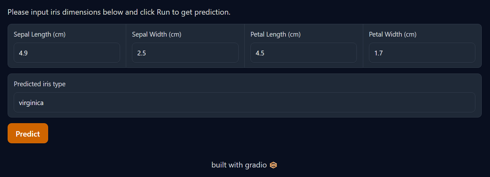

# Gradio Playground

[Gradio](https://github.com/gradio-app/gradio) is a python library used to quickly build data science or machine learning demos. The purpose of this repository is to showcase various applications of interacting with a machine learning model to retrieve predictions.

## Example app
